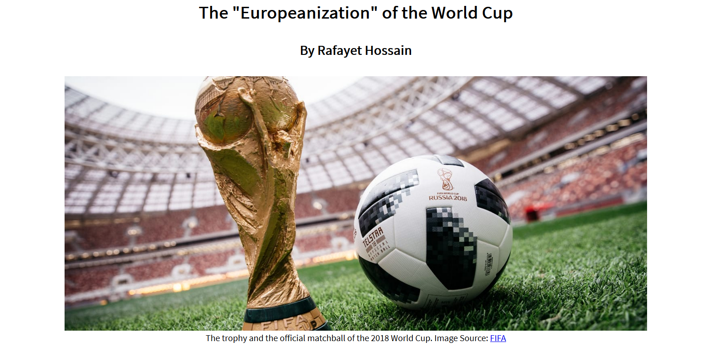

# Final Portfolio

## Exploratory Project

#### Abstract: 

This project was concerned with visualizing all of the countries in which players that played at every World Cup play soccer professionally. Soccer players play for both a "national" team and a "club" team. National teams represent a country in international tournaments, such as the World Cup. Club teams, on the other hand, represent a city or a region within a country, and play within its country’s leagues. This project uses a map and a bar graph to visualize the data. It was inspired by a visualization by [Andy Kriebel](https://public.tableau.com/profile/andy.kriebel#!/vizhome/WorldCupPlayers/WorldCup).

#### [Deployed path](https://rhossain23.github.io/worldCupCountries/)

#### Screenshots from the project:

#### Data: 

The data was obtained directly from [FIFA](https://www.fifa.com/)'s website, by way of the "references" sections on Wikipedia articles for every edition of the World Cup, such as the [1930 tournament](https://en.wikipedia.org/wiki/1930_FIFA_World_Cup_squads#References). These Wikipedia articles had links to archived reports on FIFA's website from every World Cup ever that provided all of the data I needed. The prospectus for my project talked about using data from Transfermarkt and WhoScored, two soccer statistics groups, but they did not have the data that I wanted. [D3.js](https://github.com/d3/d3/wiki) was used to create the visualizations.

#### Artifact of design process: 

## Narrative Project

#### Abstract: 

This project was an extension of my exploratory project. While I was doing that project, I noticed that in the early years of the World Cup, most players would play their club soccer in the country that they represented at the tournament. However, as the years went on, more and more players from non-European countries would move to Europe and join European clubs, and so players that played club soccer in Europe became the largest group of players at the World Cup. This project explored this phenomenon with maps and graphs and offered a possible reason for this trend. 

#### [Deployed path](https://rhossain23.github.io/worldCupCountries/)

#### Screenshots from the project:

#### Data: 

The data was obtained directly from [FIFA](https://www.fifa.com/)'s website, by way of the "references" sections on Wikipedia articles for every edition of the World Cup, such as the [1930 tournament](https://en.wikipedia.org/wiki/1930_FIFA_World_Cup_squads#References). These Wikipedia articles had links to archived reports on FIFA's website from every World Cup ever that provided all of the data I needed. The prospectus for my project talked about using data from Transfermarkt and WhoScored, two soccer statistics groups, but they did not have the data that I wanted. I also included a visualization of the richest soccer clubs in the world, and I obtained this data from the [Deloitte Football Money League](https://www2.deloitte.com), again by way of the "references" section on the [Wikipedia article](https://en.wikipedia.org/wiki/Deloitte_Football_Money_League#References). [D3.js](https://github.com/d3/d3/wiki) was used to create the visualizations.

#### Artifact of design process: 

## Reflection

After completing both the exploratory project and the narrative project, I feel that I have a better understanding of what type of design decisions work the best for me. As mentioned in the abstract above, my exploratory project was inspired by a visualization for one set of data, the 2014 World Cup, so I decided to expand upon it by visualizing every World Cup ever. I noticed that the author of the visualization I was inspired by used both a map and a bar graph, and I realized that those two were also ideal for my purposes, since they would effectively convey the information I obtained. However, since my visualization was concerned with every World Cup ever, I had to come up with a way to filter the data by the year of the tournmanet, and I figured I might as well use a dropdown menu because that was the only way I knew how to filter data at the time. When I moved on to the narrative project, I had learned how to use a slider and decided to use that instead because I feel that sliders are more efficient than dropdown menus for the user. The narrative project was an extension of the first project, so I used maps and a bar graph again, but there was one part of the data, the most important part, that could not be visualized as a map or a bar graph. This data was concerned with how individual populations changed over time, so I had to come up with another way to visualize it, and I decided that a line chart would be the most useful. 

If I were to develop my own design process, I think it would still follow the process taught in class. The first thing I did was come up with the idea for the project, which mirrored the ideation phase. Next, I thought about the most effective ways to visualize this data and sketched them out, which mirrored the brainstorming and sketches phase. However, one difference between my process and the process taught in class is that I combined the structural architecture phase and the data analysis and prep phase, as I worked on them simultaneously for both projects. 

The most helpful thing I learned from my projects actually came from how the critiques benefited my narrative project. When I was presenting the idea for my topic, I assumed that nobody in our class follows soccer as much as I do, so I had to figure out how to get everybody to understand what I was talking about. Soccer is extremely complicated so I had to determine how to concisely tell everybody what they had to know so they wouldn’t feel lost. When I was actually doing my project, I decided to keep in mind that there might be users who have no idea how professional soccer works, and I made sure to explain everything as well as possible for these people. I now think that the best visualizations are made with the idea that there will be some users that either have very little or no knowledge at all about the topic at all, but can still understand what’s going on and come away learning something new. 

The prospectus for my exploratory project was pretty accurate and representative of the final product. The only difference was that I didn’t end up using the data sources I listed in the prospectus, as they didn’t make the data easily accessible. The sketch I created for this project was also different from the final version, as I planned on having a help box on the left side of the graphs below the dropdown menu. Instead, I ended up putting the background information on the bottom of the bar graph because I realized that I like having my visualizations as big and spread out as possible, in order to make them more viewable, and I felt that putting the background information on the left would have taken away from this.

The prospectus for my narrative project, on the other hand, was pretty different from my final product. I stated in the prospectus that “I am planning on looking at the various clubs that are represented at the World Cup, and I will also see if any of the players changed clubs in between tournaments,” but I didn’t do either of those things. As I was working through my project, I found that using a line chart to look at player movement over the years would be a better way to represent the phenomena that I was exploring, so I decided to follow through on that method instead. Also, the same thing happened again with the data sources, as I found that they didn’t make the exact information I was looking for easily accessible. The sketch for this prospectus was also very different from the final project. I stated that I wanted to create a table, but when I finally did, I didn’t like the outcome. Since I was still looking at countries, I felt that a table was too bland, so I decided to create another map instead, which was much more effective in conveying the information.

The major challenge I had with both of these projects is that I am still unable to call either of them complete. I consider myself to be a perfectionist when it comes to my work so I never felt that either of the projects were finished products. Every time I looked at them, I was always coming up with new ways to change them or add more information. If I had more time and resources, both projects might have ended up radically different. If anything, I will probably end up continuing to work on these projects in my spare time after this class ends. One other general problem I had was that I would come up with a new idea and search up how to implement it using D3, but then I would find that the solution uses D3 v3 or D3 v4, which uses functions and commands that do not exist in D3 v5 anymore, and I couldn’t figure out how to adapt the solutions to v5, so I would end up giving up. I think if I spend more time learning the ins and outs of D3, I will be able to mitigate this problem in the future.
